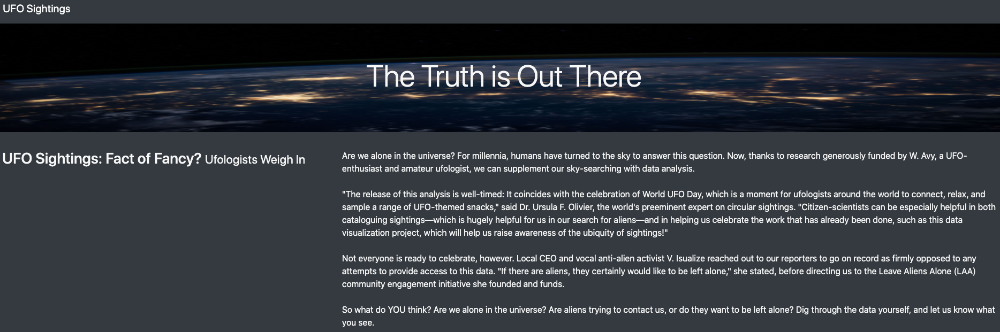
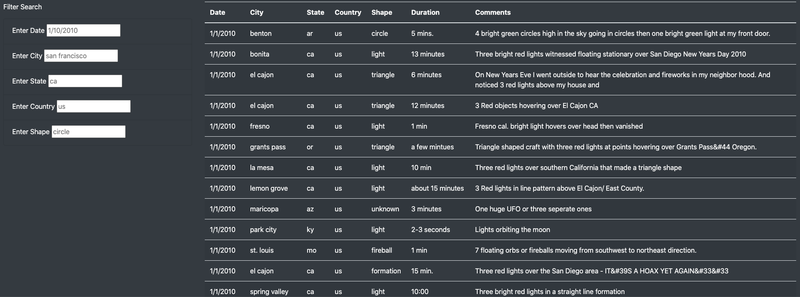
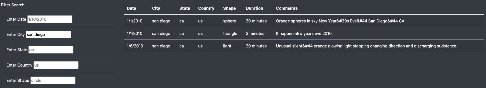
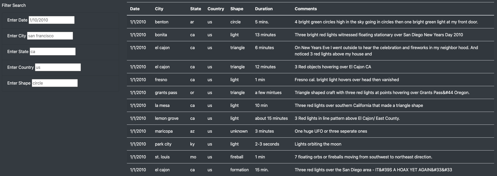

# UFOs
JavaScript, HTML and CSS is used to created a dynamic table within an HTML webpage to showcase UFO sightings.

## Overview
Dana is a data journalist who is given the opportunity to write about a popular topic in her hometown UFO sightings. Her source of information is a JavaScript file filled with sighting information including. The sighting data includes date, city, state, country, type of sighting, and comments. Dana's plan is to use JavaScript to the data in table. Since Dana will be posting the article online, Dana wants to put everything into an HTML page including her article, the table of data to support her findings and easy to use filters to fine tune her results. 

## Results
The table can be filtered by following criteria: Date, City, State , Country, or Shape. The filters are on the left side of the picture below.

When the user enters their search criteria, the javascript code will store that value and will filter the data down to display the criteria entered. Here is an example with the city filtered to "san diego" and the state filtered to "ca".

## Summary
One drawback of the webpage is there are two data columns that do not have any filters. Those columns are Duration and Comments.

